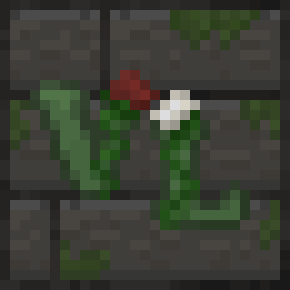

<p align="center">
  
</p>

<p align="center">
  <a href="README.ru.md">Русская версия</a>
</p>

<p align="center">
  
  
  
  
</p>

# Vivarium Libera

**Vivarium Libera** is a nature and herbalism expansion for Minecraft. It fills the world with medicinal plants, wetland flora, plum trees, streams, handcrafted decorations, and the first tools of an herbalist's workshop—while keeping everything close to Minecraft's visual language.

> [!WARNING]
> Vivarium Libera is in **early alpha**. Features, recipes, balance, and world-generation behavior may change between builds. Back up important worlds before updating.

## At a glance

| Component | Supported version |
| --- | --- |
| Minecraft | `1.21.1` |
| Mod loader | NeoForge `21.1.172` or newer `21.1.x` |
| Java | `21` |
| GeckoLib | `4.8.4+` — required |
| Farmer's Delight | Optional integration |
| Mod version | `0.1.0` (alpha) |
| Mod ID | `vivariumlibera` |

Install the mod and GeckoLib on both the client and the server. Farmer's Delight is optional; when present, Vivarium Libera adds compatible cutting recipes and ingredient tags.

## Features

### A living herbarium

- More than twenty medicinal, poisonous, decorative, wetland, and aquatic plants.
- Dedicated placement rules for ordinary, moisture-loving, and water plants.
- Harvestable plants that can be cut with an herbalist's knife and regrow over time.
- English and Russian names for the mod's blocks, items, screens, and creative tabs.

### Herbalist's craft

- An herbalist's knife for gathering usable plant material.
- An animated mortar with block-entity processing for herbal ingredients.
- A readable herbalist's book with an in-game reference screen.
- Herbal powders, poison, and an expanding set of workshop recipes.

### Alchemy and decoctions

- An alchemy table with its own screen: pour a jug into the cauldron, add up to three ground herbs, light the hearth with flint and steel, and watch the brew progress.
- Water, oil, and wine each yield different results; one jug fills three portions.
- Sawdust turns the hearth into a strong blue flame, which the harder recipes require.
- Six decoctions — Herbal Vision, Stone Skin, Light Step, Antidote, Stupor, and Fire Blood — bottled into vials.
- Recipes, brew times, and flame requirements are shown in JEI.

### Nature and decoration

- A complete plum wood family: logs, stripped logs, planks, stairs, slabs, fences, gates, buttons, pressure plates, trapdoors, leaves, and saplings.
- Compact plum trees with several foliage stages and ripe and unripe fruit.
- Placeable clay jugs for water, oil, and wine, each with empty and full variants.
- Natural stream world generation designed to make landscapes feel less static.

## Integrations

| Project / API | Integration |
| --- | --- |
| [GeckoLib](https://github.com/bernie-g/geckolib) | Required animation runtime |
| [Farmer's Delight](https://github.com/vectorwing/FarmersDelight) | Optional cutting recipes and shared ingredient tags |
| [JEI](https://github.com/mezz/JustEnoughItems) | Development runtime for recipe-display checks |
| NeoForge common tags | Shared fruit, herb, knife, and compostable item groups |

## Installation

1. Install Minecraft `1.21.1` with NeoForge `21.1.172` or a newer `21.1.x` build.
2. Install GeckoLib `4.8.4` or newer for Minecraft `1.21.1`.
3. Download Vivarium Libera from the [GitHub Releases](https://github.com/iwosw/Vivarium-Libera/releases) page, or build it from source.
4. Put the Vivarium Libera and GeckoLib `.jar` files into the `mods` folder on the client and server.
5. Optionally install Farmer's Delight to enable its compatibility recipes.

## Build from source

The project includes the Gradle Wrapper; only JDK 21 is required.

```bash
# Windows
./gradlew.bat build

# Linux / macOS
./gradlew build
```

The compiled mod is written to `build/libs/`.

Useful development tasks:

```bash
./gradlew runClient
./gradlew runServer
./gradlew runData
```

## Project layout

| Path | Purpose |
| --- | --- |
| `src/main/java/com/iwosw/vivariumlibera` | Gameplay code, registries, client code, integrations, and data generators |
| `src/main/resources/assets/vivariumlibera` | Textures, models, blockstates, animations, geometry, and localization |
| `src/main/resources/data` | Recipes, tags, loot tables, data maps, and world-generation data |
| `src/generated/resources` | Data-generator output included in development builds |

## Support and contributing

Found a bug or incompatibility? [Open an issue](https://github.com/iwosw/Vivarium-Libera/issues) and include:

- the exact Vivarium Libera, NeoForge, GeckoLib, and Minecraft versions;
- whether the issue happens in single-player or on a dedicated server;
- steps to reproduce it; and
- the relevant `latest.log` excerpt or crash report.

Focused bug fixes and improvements are welcome. Please keep pull requests small, explain player-visible changes, and verify them with `./gradlew build` before submission.

## License

Vivarium Libera is distributed under the terms in [LICENSE](LICENSE). The source code and assets are **All Rights Reserved** unless the license explicitly grants a use.

---

<p align="center"><em>Grow the wild. Study the useful. Craft with care.</em></p>